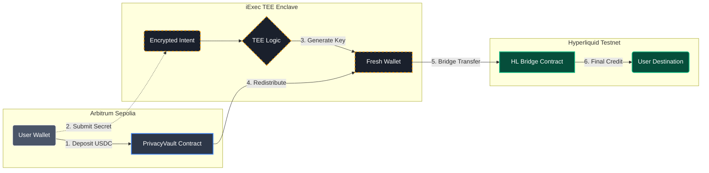

# {HyperSecret}

Anonymous USDC deposits on Hyperliquid Testnet via iExec TEE (SGX/SCONE).

## How It Works



**Privacy guarantee**: An on-chain observer sees `Vault -> FreshWallet -> Bridge -> Destination` but **cannot link** the original depositor to the final recipient. The mapping is encrypted inside the TEE enclave.

## Architecture

| Component | Stack |
|-----------|-------|
| Smart Contract | Solidity 0.8.20, OpenZeppelin 5.x (`PrivacyVault.sol`) |
| TEE Runtime | Node.js + ethers.js v6, iExec SGX/SCONE enclave |
| Frontend | React 19, Vite, wagmi, viem, @tanstack/react-query |
| Bridge | Hyperliquid Testnet bridge + EIP-712 usdSend |

## Deployed Addresses (Arbitrum Sepolia)

| Contract | Address |
|----------|---------|
| PrivacyVault | `0x36f6DcDd2200Fd3d044351A545635AC8F39ee1E7` |
| iApp (iExec TEE) | `0x00944931c04C52159F9060dA4C7F0caa73c418Af` |
| TEE Wallet | `0xf308D795A3635d443A99B28438936ea9036dD6b5` |
| USDC (Circle) | `0x75faf114eafb1BDbe2F0316DF893fd58CE46AA4d` |
| USDC2 (HL Bridge) | `0x1baAbB04529D43a73232B713C0FE471f7c7334d5` |
| HL Bridge | `0x08cfc1B6b2dCF36A1480b99353A354AA8AC56f89` |

## Features

- **Anonymous Bridge** - Deposit USDC to vault, TEE breaks the on-chain link via fresh wallets
- **iExec SGX** - Real TEE execution in production (Intel SGX via SCONE)
- **Fallback Server** - Demo mode when iExec workerpool is unavailable
- **Chain Validation** - Wallet must be on Arbitrum Sepolia to bridge

## Project Structure

```
privacy-bridge/
├── contracts/              # Hardhat - PrivacyVault.sol
├── tee-app/
│   ├── standalone/         # privacyBridge.js (test + fallback logic)
│   ├── iapp/               # iExec iApp (Docker + SGX)
│   └── fallback-server/    # Express fallback API
└── frontend/               # React + Vite + wagmi
    └── src/
        ├── config/         # wagmi.js, contracts.js
        └── components/     # BridgeWidget, ConnectButton, etc.
```

## Quick Start

```bash
# Frontend
cd frontend
npm install
npm run dev

# Smart contracts
cd contracts
npm install
npx hardhat test
npx hardhat run scripts/deploy.js --network arbitrumSepolia
```

## Team

- **skar88** - [@0xhaizeka](https://x.com/0xhaizeka)
- **Aiden** - [@aiden_7788](https://x.com/aiden_7788)

---

Built for the iExec Hackathon.
